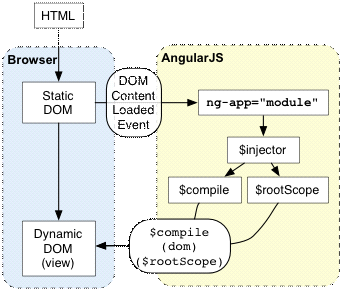
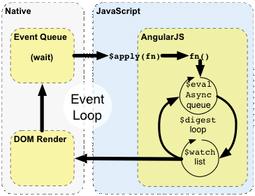

# AngularJs --concepts(概念)

## 一、总括

本文主要是angular组件(components)的概览，并说明他们如何工作。列表如下：

* statup - 依旧是hello world...改为Hello Kitty！
* runtime - 介绍angular的runtime
* scope - view与contorller的纽带（神马glue...胶）
* controller - app的行为(application behavior)
* model - app的数据
* view - 用户所看到的东东
* directives - HTML的语法扩展
* filters - 根据用户的本地格式，格式化数据
* injector - 加载我们的app（依赖管理之类）
* module - 配置injector
* $ - angular的命名空间（namespace）

## 二、启动（Startup）

下面描述 angular 是如何启动的（参考图表与下面的例子）：

1. 浏览器加载HTML，将HTML标签转换为DOM对象；

2. 浏览器加载angular.js的脚本；

3. Angular等待DOMContentLoaded事件；

4. Angular寻找ng-app这个用于指定应用边界范围的directive；

5. 如果ng-app有指定module（也许是ng-app=”SomeApp”），将被用作配置`$injector` ；

6. `$injector` 用于创建`$compile`服务（service）以及`$rootScope`;
7. `$compile` 服务用作“编译”（有点像遍历，然后做一点神秘的事情）DOM，并将其与对应的 `$rootScope`连接。

8. ng-init 这个directive在对应的scope中创建name属性并对其赋予”Kitty”值；

9. 将“{{name}}”的值插入(interpolates)到表达式中，最终显示”Hello Kitty!”。



``` html
<!DOCTYPE html>
<html lang="zh-cn" ng-app>
<head>
    <meta charset="UTF-8">
    <title>Hello Kitty!</title>
    <style type="text/css">
        .ng-cloak {
            display: none;
        }
    </style>
</head>
<body>
<div ng-init="name='Kitty'">Hello {{name}}!</div>
<script src="../angular-1.0.1.js" type="text/javascript"></script>
</body>
</html>
```

 

## 三、Runtime


　　这图表和后面的例子，描述了angular如何通过浏览器event-loop（所有的时间处理函数，以及timer执行的函数，会排在一个queue结构中，利用一个无限的循环，不断从queue中取出函数来执行，这个就是event-loop。来自http://wiki.nodejs.tw/nodejs_from_scratch/javascript-yunodejs/2-1-event-loop）来进行交互。

1. 浏览器event-loop等待事件到来。事件来自于用户交互（DOM events）、timer事件（setTimeout）、network事件（服务端响应，XHR之类）；
2.  事件回调函数开始执行。这里进入javascript上下文（context）。这回调函数可以修改DOM结构。
3.  当回调函数执行完毕后，浏览器退出javascript context，根据DOM的改变来重绘视图。

　　Angular通过创建自己的事件处理循环（event processing loop），修改了一般的javascript流（flow）。这将Javascript分割成传统的和Angular的执行上下文（execution context）。只要是在Angular execution context 里面执行的操作，都拥有angular data-binding、异常处理（exception handling）、属性监视（property watching）等能力。我们可以通过在javascript使用 `$apply()` ，进入Angular execution context。但要记住一点，在大多数（angular的）地方（如controllers、services），处理事件的directive会为你调用$apply。手动调用$apply的场景，一般是当你实现自定义事件处理函数，或者处理第三方库的回调的时候。

1. 通过调用scope.$apply(stimulusFn)进入angular execution context。stimulusFn就是我们想在angular execution context中执行的函数（含scope作为参数）或者angular合法的表达式。

2. Angular执行stimulusFn，这通常会改变应用的状态（application state）。

3. Angular进入$digest loop。这个loop由一个处理$evalAsync queue 和处理$watch list两个更小的循环组成。$digest loop会在model稳定之前保持迭代，即$evalAsync queue为空，而且$watch list没有检测到任何变化。

4. $evalAsync queue被用作安排必须跳出当前堆栈帧（堆栈帧指的是在堆栈中为当前正在运行的函数分配的区域（或空间）。传入的参数、返回地址（当这个函数结束后必须跳转到该返回地址。译注：即主调函数的断点处）以及函数所用的内部存储单元（即函数存储在堆栈上的局部变量）都在堆栈帧中。http://book.51cto.com/art/200804/70915.htm C.1.1  堆栈帧）之外，但在浏览器视图绘制之前的工作。这通常是通过使用setTimeout(0)来实现。但setTimeout(0)这方法，会导致缓慢，或者在每个事件处理完毕后，浏览器绘制视图时，出现视图闪烁（angular有没有去解决这个问题？如何解决？）。

5. `$watch list` 是有可能在最近一次迭代中被修改的表达式的集合。如果(model)发生了改变，那么$watch 函数会被调用，从而达到对特定的DOM重新赋值的目标。
   
6.  一旦Angular $digest loop 完成了（之前3提到的情况），离开angular和javascript的context后，浏览器紧跟着就会去重绘DOM，以响应变化。

　　下面解释例子“Hello Kitty”(-_-!)是如何在用户在文本框输入文本时实现数据绑定(data-binding)效果。

1. 编译阶段(compilation phase)：
    
    a) ng-model和input directive在 `<input> `中版定keydown事件监听器。

    b) `{{name}}` 占位符（interpolation，不知道怎么翻译）（表达式）设置一个$watch以便在name发生改变时有所响应。

2. 执行阶段(runtime phase)：

    a) 在input控件中按下”X”按钮，让浏览器触发一个keydown事件；

    b) input directive捕捉到文本框值的改变，然后调用$apply(“name = ‘X’;”)，在angular execution context中更新应用的model。

    c) Angluar将 “name = ‘X’;”应用在model中。(model发生改变)

    d) $digest loop开始

    e) $watch list检测到name的值被改变了，然后再次解析{{name}}表达式，然后更新DOM。

    f) Angulart退出(angular) execution context，再依次退出keydown事件以及javascript execution context；

    g) 浏览器重绘视图，更新字符。

``` html
<!DOCTYPE html>
<html lang="zh-cn" ng-app>
<head>
    <meta charset="UTF-8">
    <title>Hello Kitty!</title>
    <style type="text/css">
        .ng-cloak {
            display: none;
        }
    </style>
</head>
<body>
    <input ng-model="name" class="ng-cloak"/>
    <p>Hello {{name}}!</p>
<script src="../angular-1.0.1.js" type="text/javascript"></script>
</body>
</html>
```
 

四、Scope

　　scope的是负责检测model的变化，并作为表达式的执行上下文(execution context)。Scope是在一个类似于DOM结构的层次结构中嵌套的（据之前了解，划分可能跟controller有关）。（详情查看individual directive documentation，看看哪个directive会创建新的scope）

　　下面的例子展示”name”这个表达式的值是根据它依赖（所属）的scope决定的，而且还包含了值查找的方式（类似Js的作用域链，自己没有就找老爸要）。

``` html
<!DOCTYPE HTML>
<html lang="zh-cn" ng-app>
<head>
    <meta charset="UTF-8">
    <title>scope</title>
    <style type="text/css">
        .ng-cloak {
            display: none;
        }
    </style>
</head>
<body>
<div class="ng-cloak" ng-controller="ControllerA">
    Hello {{name}}!;
</div>
<div class="ng-cloak" ng-controller="ControllerB">
    Hello {{name}}!;
    <div class="ng-cloak" ng-controller="ControllerC">
        Hello {{name}}!;
        <div class="ng-cloak" ng-controller="ControllerD">
            Hello {{name}}!;
        </div>
    </div>
</div>
<script src="../angular-1.0.1.js" type="text/javascript"></script>
<script type="text/javascript">
    function ControllerA($scope) {
        $scope.name = 'Kitty';
    }

    function ControllerB($scope) {
        $scope.name = 'Lcllao';
    }

    function ControllerC($scope) {
        $scope.name = 'Jeffrey';
    }

    function ControllerD($scope) {

    }
</script>
</body>
</html>
```
 

五、Controller


复制代码
<!DOCTYPE HTML>
<html lang="zh-cn" ng-app>
<head>
    <meta charset="UTF-8">
    <title>Controller</title>
    <style type="text/css">
        .ng-cloak {
            display: none;
        }
    </style>
</head>
<body>
<div class="ng-cloak" ng-controller="ControllerA">
    Hello {{name}}!
    <button ng-click="doIt()">DoIt!!</button>
</div>
<script src="../angular-1.0.1.js" type="text/javascript"></script>
<script type="text/javascript">
    function ControllerA($scope) {
        $scope.name = 'Kitty';
        $scope.doIt = function() {
            $scope.name = "Handsome";
        };
    }
</script>
</body>
</html>
复制代码
　　Controller是在view背后的代码(-_-!)。它的职责是构建model，并通过回调函数，将其（model）推送到view中。View是当前scope到template(HTML)的映射（翻译得有点勉强...）。Scope是指挥model到view以及向controller发送event的纽带。

　　Controller与view分离是很重要的，因为：

Controller是写在javascript中的。Javascript是命令式的（imperative）。命令（imperative）是描述应用程序行为的一个好方法。Controller不应该包含任何显示信息（的逻辑）（DOM引用或者HTML片段）
View模版是写在HTML里的。HTML是声明式的。声明式（的HTML）是描述UI的好方法。View不应该包含任何行为。
由于Controller不知道自己需要对应哪一个View，使得一个Controller可以（间接）使用多个View。这对于re-skinning（更换皮肤？）、其他设备特定的视图（例如手机与桌面）还有代码的可测性是很重要的。
 

六、Model


　　Model，可以理解为数据对象。它被用作与模版结合，以产生视图。为了将model写入到视图中，model必须被scope所引用。与很多其他框架不一样，angular对model没有任何限制与要求。不需要额外添加class，也不需要通过特殊的特权方法去访问或者改变model。Model的数据类型，可以是原始的类型（string、number……），可以是键值对象({a:1,b:2})，也可以是函数（function() {…}）。简要地说，angular的model只需要是一个普通的javascript对象。

 

七、View

　　view是用户所能看到的东西。view诞生于模版。它与model结合，最终呈现为浏览器DOM。Angular采取一个对于其他很多模版系统来说，很不一样的方式去呈现View。


其他模版引擎：很多模版引擎，是通过建立带有特殊标记的HTML字符串来实现的。通常这些模版标记破坏了HTML的语法，这意味着不能通过一般的HTML编辑器去编辑代码（这个嘛…）。模版字符串传入模版引擎，与数据合并。最终生成HTML字符串。这些字符串一般通过.innerHTML的方式写入DOM中，促使浏览器呈现模版内容。当数据发生改变时，这个过程需要一次又一次地重复。模版的粒度与DOM更新的粒度一致。这粒的关键，是模版系统处理字符串。
Angular：Angular模版的不同之处，在于它是基于DOM的而不是基于字符串的。模版依然需要在HTML中写入一些字符串，但依旧是HTML（不是通过在里面嵌入模版）。浏览器把HTML转换为DOM，然后DOM成为了compiler（angular的模版引擎）的输入。Compiler查找directives，依次在model中设置watches。得出的结果，是一个一直更新的view，不需要重新拼接model与template。model成为了view的唯一数据来源（single source of truth）。
 八、Directives

　　Directive是一个行为（例如之前文章的例子“躲猫猫”）或DOM转换（自定义标签，里面包含一组DOM），将其名称放在属性、标签名、class名里面都可以触发该directive。Directive允许你以声明的方式扩展HTML的标签。

　　下面的例子，还有一些疑问。就是$render如何触发@_@

复制代码
<!DOCTYPE HTML>
<html lang="zh-cn" ng-app="myDirective">
<head>
    <meta charset="UTF-8">
    <title>directive</title>
    <style type="text/css">
        .ng-cloak {
            display: none;
        }
    </style>
</head>
<body ng-controller="MyCtrl">
<div ng-model="content" contenteditable="true">My Little Dada</div>
<pre class="ng-cloak">modelValue = {{content}}</pre>
<button ng-click="reset()">reset(change model)</button>
<script src="../angular-1.0.1.js" type="text/javascript"></script>
<script type="text/javascript">
    angular.module("myDirective",[])
            .directive("contenteditable",function() {
                return {
                    require:'ngModel',
                    link:function (scope, element, attr, ngModel) {
                        function setVal() {
                            ngModel.$setViewValue(element.text());
                        }

                        // veiw -> model
                        element.bind("keyup",function() {
                            scope.$apply(setVal);
                        });
                        // model -> view
                        ngModel.$render = function(val) {
                            console.log("render running");
                            element.html(val);
                        };
                        //init
                        setVal();
                    }
                }
            }
    ).controller("MyCtrl",function($scope) {
                $scope.reset = function() {
                        $scope.content = "My Little Dada";
                };
            });
</script>
</body>
</html>
复制代码
 

九、Filters

　　Filters 扮演一个数据转换（格式化）的角色。通常他们是与地域有关的，不同地域也许会有不同的输出格式。他们在追随了Unix过滤器的精神与类似的语法：|  (pipe)

复制代码
<!DOCTYPE HTML>
<html lang="zh-cn" ng-app>
<head>
    <meta charset="UTF-8">
    <title>filter</title>
    <style type="text/css">
        .ng-cloak {
            display: none;
        }
    </style>
</head>
<body>
<div ng-init="list = ['百度B','搜狗S','360','3SB']">

    数字格式化: 1233211234567 -> {{1233211234567|number}}<br/>
    数组过滤，然后通过json格式输出: <input ng-model="myFilterText" type="text"/><br/>
    {{list|filter:myFilterText|json}}<br/>
</div>
<script src="../angular-1.0.1.js" type="text/javascript"></script>
</body>
</html>
复制代码
 

 十、Modules and the Injector


　　Injector是一个服务定位器。每一个Angular应用，都会有一个单独的injector。Injector提供一个通过名称查找对象实例的途径。Injector会在内部cache中保持所有对象实例，所以重复调用相同的名称时，返回的都是同一个对象实例。如果对象不存在，那么它会请求实例工厂（instance factory）去创建一个新实例。

　　Module是一个配置injector的实例工厂的方法，被称为”provider”。

复制代码
    // Create a module
    var myModule = angular.module('myModule', [])
     
    // Configure the injector
    myModule.factory('serviceA', function() {
    return {
    // instead of {}, put your object creation here
    };
    });
     
    // create an injector and configure it from 'myModule'
    var $injector = angular.injector('myModule');
     
    // retrieve an object from the injector by name
    var serviceA = $injector.get('serviceA');
     
    // always true because of instance cache
    $injector.get('serviceA') === $injector.get('serviceA');//true
复制代码
　　但是injector的真正牛X的地方在于它可以用于调用方法和”instantiate” type。这个美妙的特性是允许method和types请求他们所依赖的资源，而不是寻找他们。

 

复制代码
    // You write functions such as this one.
    function doSomething(serviceA, serviceB) {
    // do something here.
    }
     
    // Angular provides the injector for your application
    var $injector = ...;
     
    ///////////////////////////////////////////////
    // the old-school way of getting dependencies.
    var serviceA = $injector.get('serviceA');
    var serviceB = $injector.get('serviceB');
     
    // now call the function
    doSomething(serviceA, serviceB);
     
//上面是传统的老方法~下面是angular说自己的牛X方法

    ///////////////////////////////////////////////
    // the cool way of getting dependencies.
    // the $injector will supply the arguments to the function automatically
    $injector.invoke(doSomething); // This is how the framework calls your functions
复制代码
 

　　注意，我们唯一需要写的，就是我们的function，在function的arguments中列出方法依赖的资源即可！当angular调用function时，他会使用”call”方法，自动填充function agruments。

　　留意下面的例子中是如何在constructor中列出依赖的。当ng-controller实例化controller时，将自动提供所依赖的资源。没有必要去创建、寻找、创建injector引用来加载依赖资源。

复制代码
<!DOCTYPE HTML>
<html lang="zh-cn" ng-app="timeExample">
<head>
    <meta charset="UTF-8">
    <title>injector</title>
    <style type="text/css">
        .ng-cloak {
            display: none;
        }
    </style>
</head>
<body>
<div ng-controller="ClockCtrl" class="ng-cloak">
    Current time is : {{time.now}}
</div>
<script src="../angular-1.0.1.js" type="text/javascript"></script>
<script type="text/javascript">
    angular.module("timeExample", []).factory("myClock", function ($timeout) {
        var time = {};
        (function tick() {
            time.now = new Date().toString();
            $timeout(tick, 1000);
        })();
        return time;
    });
    /**
     *
     * @param $scope
     * @param myClock 这里自动插入了依赖的myClock！！
     * @constructor
     */
    function ClockCtrl($scope,myClock) {
        $scope.time = myClock;
    }
</script>
</body>
</html>
复制代码
 

十一、Angular Namespace

为了防止名称冲突，angular会在object的名称中加入前缀$。请不要在代码中使用$前缀以避免冲突。(-_-!! )