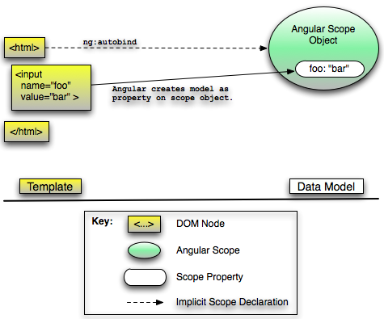

# AngularJs --Understanding the Model Component
原版地址：http://docs.angularjs.org/guide/dev_guide.mvc.understanding_model

 

　　在angular文档讨论的上下文中，术语“model”可以适用于单一对象代表一个实体（例如，一个叫” phones”的model，它的值是一个电话数组。）或者作为应用的全部数据Model（所有实体）。

　　在angular中，model可以是任意数据，可以通过angular的scope对象的属性来获取model。属性的名称是model的标识，值可以是任意javascript对象（包括数组和原始数据）。

　　javascript想成为model的唯一的条件是对象必须作为一个scope对象的属性被angular scope引用。属性的引用关系可以明确或者隐含地创建。

　　我们可以通过以下几种方式来显式创建scope的属性，关联javascript对象来创建model：

在javascript代码中，直接赋值给scope对象的属性；这通常发出现在controller中：
``` js
function MyCtrl($scope) {

     // create property 'foo' on the MyCtrl's scope

     // and assign it an initial value 'bar'

     $scope.foo = 'bar';

 }
```
在模版的angular表达式（http://www.cnblogs.com/lcllao/archive/2012/09/16/2687162.html）中，使用赋值操作符：
`<button ng-click="{{foos='ball'}}">Click me</button>`
在模版中使用ngInit directive（http://docs.angularjs.org/api/ng.directive:ngInit）（仅仅作为例子，不推荐在真实应用中使用）
<body ng-init=" foo = 'bar' ">
 

　　angular在下面的模版结构中会隐式创建model：

表单的input 、select、textarea和其他form元素：
<input ng-model="query" value="fluffy cloud">
　　上面的代码，在当前的scope中创建了一个叫”query”的model，并且与input的value值绑定，初始化为”fluffy cloud”。

在ngRepeater中声明迭代器
<p ng-repeat="phone in phones"></p>
　　上面的代码为每一个phones数组的元素各自创建了一个child scope，并且在对应的child scope中创建”phone”model，赋予数组中对应的值。

　　在angular中，当出现下面的情况时，javascript对象将不再是一个model：

当没有angular scope包含与该对象关联的属性时。
所有包含与对象关联的属性的angular scope成为了陈旧和适合垃圾回收时。
　　下面的插图展示了在一个简单的模版中隐式创建一个简单的数据model。

