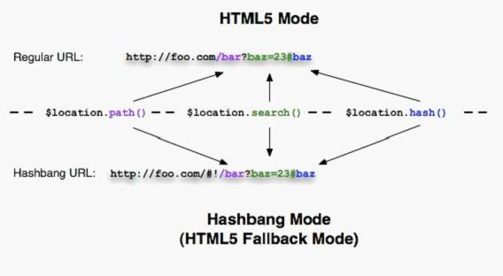
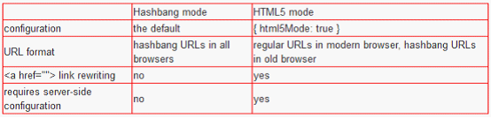

# AngularJs --Using $location
原版地址：http://code.angularjs.org/1.0.2/docs/guide/dev_guide.services.$location

 

### 一、What does it do?

　　$location服务分析浏览器地址栏中的URL（基于window.location），让我们可以在应用中较为方便地使用URL里面的东东。在地址栏中更改URL，会响应到$location服务中，而在$location中修改URL，也会响应到地址栏中。

　　$location服务：

暴露当前浏览器地址栏的URL，所以我们可以
注意和观察URL
改变URL
当用户做以下操作时，与浏览器一起同步URL：
改变地址栏
单击后退或者前进按钮（或者点击一个历史链接）。
单击一个链接
将URL对象描绘为一系列的方法（protocol，host，path，search，hash）。
1. 比较$location和window.location

　　1) 目的：window.location和$location服务，都允许对当前浏览器的location进行读写访问。

　　2) API：window.location暴露一个未经加工的对象，附带一些可以直接修改的属性；而$location服务则是暴露一些jQuery风格的getter/setter方法。

　　3) 与angular应用声明周期的整合：$location知道关于所有内部声明周期的阶段，与$watch等整合；而window.location则不行。

　　4) 与HTML5 API无缝结合：是（with a fallback for legacy browsers，对于低版本的浏览器有兼容手段？）；而window.location则没有。

　　5) 知道应用加载的文档根目录(docroot)或者上下文(context)：window.location不行，wnidow.location.path会返回”/docroot/子路径”；而$location.path()返回真实的docroot。

 

2. When should I use $location?

　　在应用中，任何需要对当前URL的改变作出响应，或者想去改变当前浏览器的URL的时候。

3. What does it not do?

　　当浏览器URL改变的时候，不会导致页面重新加载(page reload)。如果需要做这件事情（更改地址，实现page reload），请使用较低级别的API,$window.location.href。

 

### 二、General overview of the API（API的总体概述）

　　$location 服务可以根据它初始化时的配置而有不同的表现。默认配置是适合大多数应用的，其他配置定制，可以开启一些新特性。

　　当$location服务初始化完毕，我们可以以jQuery风格的getter、setter方法来使用它，允许我们获得或者改变当前浏览器的URl。

1. $location service configuration

　　想配置$location服务，需要获得$locationProvider（http://code.angularjs.org/1.0.2/docs/api/ng.$locationProvider），并设置以下参数：

html5Mode(mode)：{boolean}，true - see HTML5 mode；false - see Hashbang mode，默认: false。（下面的章节会解释各种mode）
hashPrefix(prefix):{string}，hashbang使用的前缀（html5Mode为false时，使用hashbang mode，以适应不支持HTML5 mode的浏览器），默认:’!’
2. Getter and setter methods

　　$location 服务为只读的URL部分（absUrl，protocol，host，port）提供getter方法，也提供url，path，search，hash的getter、setter方法。

    // get the current path
    $location.path();

    // change the path
    $location.path('/newValue')
　　所有setter方法都返回同一个$location对象，以实现链式语法。例如，在一句里面修改多个属性，链式setter方法类似：
　　$location.path(‘/newValue’).search({key:value});
　　有一个特别的replace方法，可以用作告诉$location服务，在下一次与浏览器同步时，使用某个路径代替最新的历史记录，而不是创建一个新的历史记录。当我们想实现重定向（redirection）而又不想使后退按钮（后退按钮回重新触发重定向）失效时，replace方法就很有用了。想改变当前URL而不创建新的历史记录的话，我们可以这样做：

    $location.path(‘/someNewPath’).replace();
　　注意，setter方法不会马上更新window.location。相反，$location服务会知道scope生命周期以及合并多个$location变化为一个，并在scope的$digest阶段一并提交到window.location对象中。正因为$location多个状态的变化会合并为一个变化，到浏览器中，只调用一次replace()方法，让整个commit只有一个replace()，这样不会使浏览器创建额外的历史记录。一旦浏览器更新了，$location服务会通过replace()方法重置标志位，将来的变化将会创建一个新的历史记录，除非replace()被再次调用。

Setter and character encoding

　　我们可以传入特殊字符到$location服务中，服务会按照RFC3986标准，自动对它们进行编码。当我们访问这些方法时：

所有传入$location的setter方法的值，path()、search()、hash()，都会被编码。
getter方法（没参数）返回的值都是经过解码的，如path()，search()，hash()。
当我们调用absUrl()方法时，返回的值是包含已编码部分的完整url。
当我们调用url()方法时，返回的是包含path、search和hash部分的已经编码的url，如/path?search=1&b=c#hash。
 

三、Hashbang and HTML5 Modes

$location服务有两个配置模式，可以控制浏览器地址栏的URL格式：Hashbang mode（默认）与基于使用HTML5 History API的HTML5 mode。在两种模式下，应用都使用相同的API，$location服务会与正确的URL片段、浏览器API一起协作，帮助我们进行浏览器URL变更以及历史管理。





 


 

1. Hashbang mode (default mode)

　　在这个模式中,$location在所有浏览器中都使用Hashbang URL。查看下面的代码片段，可以了解更多：

```
it('should show example', inject(
    function($locationProvider) {
        $locationProvider.html5mode = false;
        $locationProvider.hashPrefix = '!';
    },
    function($location) {
    // open http://host.com/base/index.html#!/a
    $location.absUrl() == 'http://host.com/base/index.html#!/a';
    $location.path() == '/a';
    $location.path('/foo');
    $location.absUrl() == 'http://host.com/base/index.html#!/foo';
    $location.search() == {};//search没东东的时候，返回空对象
    $location.search({a: 'b', c: true});
    $location.absUrl() == 'http://host.com/base/index.html#!/foo?a=b&c';
    $location.path('/new').search('x=y');//可以用字符串的方式更改search，每次设置search，都会覆盖之前的search
    $location.absUrl() == 'http://host.com/base/index.html#!/new?x=y';
    }
));
```
　　Crawling your app(让google能够对我们的应用进行索引)
　　如果我们想让我们的Ajax应用能够被索引，我们需要在head中增加一个特殊的meta标签：

<meta name="fragment" content="!" />
　　这样做，将让爬虫机器人使用_escaped_fragment_参数请求当前的链接，让我们的服务器认识爬虫机器人，并提供对应的HTML快照。想了解更多关于这个技术的信息，可以查看https://developers.google.com/webmasters/ajax-crawling/docs/specification?hl=zh-CN

 

### 四、HTML5 mode

　　在HTML5模式中，$location服务的getter、setter通过HTML5的History API与浏览器URL进行交互，允许使用正规的path、search模块，代替hashbang的模式。如果部分浏览器不支持HTML5 History API，$location服务会自动退回到使用hashbang URL的模式。为了让我们能够从不清楚显示我们的应用的浏览器是否支持history API的担心中解脱出来，使用$location服务是一个正确的、最佳的选择。

　　在旧版浏览器中打开一个正规的URL会转换为hashbangURL。
　　在现代浏览器中打开一个hashbangURL，会重写为一个正规的URL。
1. 向前兼容旧版浏览器

　　对于支持HTML5 history API的浏览器，$location回使用它们去写path和search。如果浏览器不支持history API，$location会转为提供Hashbang URL。这是$location服务自动转换的。

2. HTML link rewriting

　　当我们使用history API mode的时候，我们对于不同的浏览器，需要不同的链接，但我们只需要提供正规的URL即可，例如<a href=”/some?foo=bar”>link</a>

当用户单击这个超链接时：

在旧的浏览器中，URL会改为/index.html#!/some?foo=bar
在现代浏览器中，URL会改为/some?foo=bar
　　在下面的情况中，链接不会被重写，而是会使页面加载到对应Url中：

包含target的超链接：<a href="/ext/link?a=b" target="_self">link</a>
到不同domain的绝对链接：<a href="http://angularjs.org/">link</a>
设置了base路径后，通过” /”开头的链接到不同base路径的超链接：<a href="/not-my-base/link">link</a>
3. server side

　　使用这个方式，在服务端请求URL重定向，通常，我们需要重定向我们所有的链接到我们的应用中。（例如index.html）。

4. Crawling your app

　　与之前相同

5. Relative links

　　确保检查所有相对链接、图片、脚本等。我们必须在<head>中指定base url（<base href="/my-base">），并在所有地方使用绝对url（以/开头）。因为相对URL会根据document的初始路径（通常与应用的root有所不同），转化为绝对url。（relative urls will be resolved to absolute urls using the initial absolute url of the document, which is often different from the root of the application）。

　　我们十分鼓励在document root中运行允许使用History API的angular应用，因为这很好地照顾到相对链接的问题。

6. Sending links among different browsers

　　（这里讲解了两种模式的地址可以适应不同浏览器，自动转换，又重复讲一次……）

7. 例子

　　在这例子中，可以看到两个$location实例，两个都是html5 mode，但在不同的浏览器上，所以我们可以看到两者之间的不同点。这些$location服务与两个假的“浏览器”连接。每一个input代表浏览器的地址栏。

　　注意，当我们输入hashbang地址到第一个“浏览器”（或者第二个？），它不会重写或重定向另外的Url，这个转换过程只会发生在page reload的时候。

``` html
<!DOCTYPE html>
<html ng-app>
<head>
    <base href=""/>
    <meta http-equiv="Content-Type" content="text/html; charset=utf-8"/>
    <title>fake-browser</title>
    <meta content="IE=edge,chrome=1" http-equiv="X-UA-Compatible">
    <style type="text/css">
        .ng-cloak {
            display: none;
        }
    </style>
</head>
<body>
<div ng-non-bindable class="html5-hashbang-example">
    <div id="html5-mode" ng-controller="Html5Cntl">
        <h4>Browser with History API</h4>
        <div ng-address-bar browser="html5"></div><br><br>
        $location.protocol() = {{$location.protocol()}}<br>
        $location.host() = {{$location.host()}}<br>
        $location.port() = {{$location.port()}}<br>
        $location.path() = {{$location.path()}}<br>
        $location.search() = {{$location.search()}}<br>
        $location.hash() = {{$location.hash()}}<br>
        <a href="http://www.host.com/base/first?a=b">/base/first?a=b</a> |
        <a href="http://www.host.com/base/sec/ond?flag#hash">sec/ond?flag#hash</a> |
        <a href="/other-base/another?search">external</a>
    </div>
    <div id="hashbang-mode" ng-controller="HashbangCntl">
        <h4>Browser without History API</h4>
        <div ng-address-bar browser="hashbang"></div><br><br>
        $location.protocol() = {{$location.protocol()}}<br>
        $location.host() = {{$location.host()}}<br>
        $location.port() = {{$location.port()}}<br>
        $location.path() = {{$location.path()}}<br>
        $location.search() = {{$location.search()}}<br>
        $location.hash() = {{$location.hash()}}<br>
        <a href="http://www.host.com/base/first?a=b">/base/first?a=b</a> |
        <a href="http://www.host.com/base/sec/ond?flag#hash">sec/ond?flag#hash</a> |
        <a href="/other-base/another?search">external</a>
    </div>
</div>
<script src="../angular.js" type="text/javascript"></script>
<script type="text/javascript">
    function FakeBrowser(initUrl, baseHref) {
        this.onUrlChange = function(fn) {
            this.urlChange = fn;
        };

        this.url = function() {
            return initUrl;
        };

        this.defer = function(fn, delay) {
            setTimeout(function() { fn(); }, delay || 0);
        };

        this.baseHref = function() {
            return baseHref;
        };

        this.notifyWhenOutstandingRequests = angular.noop;
    }
    var browsers = {
        html5: new FakeBrowser('http://www.host.com/base/path?a=b#h', '/base/index.html'),
        hashbang: new FakeBrowser('http://www.host.com/base/index.html#!/path?a=b#h', '/base/index.html')
    };

    function Html5Cntl($scope, $location) {
        $scope.$location = $location;
    }

    function HashbangCntl($scope, $location) {
        $scope.$location = $location;
    }

    function initEnv(name) {
        var root = angular.element(document.getElementById(name + '-mode'));
        angular.bootstrap(root, [
            function ($compileProvider, $locationProvider, $provide) {
                debugger;
            $locationProvider.html5Mode(true).hashPrefix('!');

            $provide.value('$browser', browsers[name]);
            $provide.value('$document', root);
            $provide.value('$sniffer', {history:name == 'html5'});

            $compileProvider.directive('ngAddressBar', function () {
                return function (scope, elm, attrs) {
                    var browser = browsers[attrs.browser],
                            input = angular.element('<input type="text" style="width:400px;">').val(browser.url()),
                            delay;

                    input.bind('keypress keyup keydown', function () {
                        if (!delay) {
                            delay = setTimeout(fireUrlChange, 250);
                        }
                    });

                    browser.url = function (url) {
                        return input.val(url);
                    };

                    elm.append('Address: ').append(input);

                    function fireUrlChange() {
                        delay = null;
                        browser.urlChange(input.val());
                    }
                };
            });
        }
        ]);
        root.bind('click', function (e) {
            e.stopPropagation();
        });
    }

    initEnv('html5');
    initEnv('hashbang');
</script>
</body>
</html>
```
 

### 五、附加说明

1. Page reload navigation

　　$location服务仅仅允许我们改变URl；它不允许我们重新加载页面（reload the page）。当我们需要改变URL且reload page或者跳转到其他页面时，我们需要使用低级点得API，$window.location.href。

2. Using $location outside of the scope life-cycle

　　$location知道angular的scope life-cycle。当浏览器的URL发生改变时，它会更新$location，并且调用$apply，所以所有$watcher和$observer都会得到通知。当我们再$digest阶段中修改$location，不会出现任何问题；$location会将这次修改传播到浏览器中，并且通知所有$watcher、$observer。当我们需要在angular外面改变$location时（例如在DOM事件中或者在测试中），我们必须调用$apply，以传播这个变化。

3. $location.path() and ! or / prefixes

　　path可以直接使用”/”开始；$location.path()setter会在value没有以”/”开头时自动补上。

　　注意”!”前缀，在Hashbang mode中，不属于$location.path()的一部分。它仅仅是hashPrefix。

### 六、Testing with the $location service

　　在测试中使用$location服务的时候，是处于angular scope life-cycle外面的。这意味着我们需要负责调用scope.apply()。

   

```
describe('serviceUnderTest', function() {
    beforeEach(module(function($provide) {
    　　$provide.factory('serviceUnderTest', function($location){
    　　// whatever it does...
    　　});
    });
    it('should...', inject(function($location, $rootScope, serviceUnderTest) {
    　　$location.path('/new/path');
    　　$rootScope.$apply();
    　　// test whatever the service should do...
    }));
});
```
 

### 七、Migrating from earlier AngularJS releases

　　在早期的angular中，$location使用hashPath或者hashSearch去处理path和search方法。在这个release中，当有需要的时候，$location服务处理path和search方法，然后使用那些获得得信息去构成hashbang URL（例如http://server.com/#!/path?search=a）。

 

### 八、Two-way binding to $location

　　angular compiler当前不支持方法的双向绑定（https://github.com/angular/angular.js/issues/404）。如果我们希望对$location对象实现双向绑定（在input中使用ngModel directive），我们需要指定一个额外的model属性（例如：locationPath），并加入两个$watch，监听两个方向上的$location更新，例如：

<input type="text" ng-model="locationPath" />

``` js
// js - controller
$scope.$watch('locationPath', function(path) {
    $location.path(path);
);
$scope.$watch('$location.path()', function(path) {
    scope.locationPath = path;
});
```
 